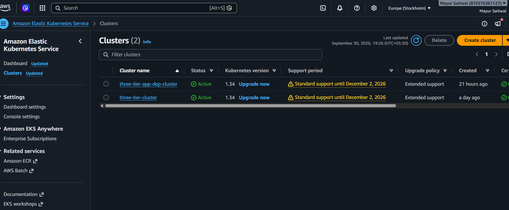
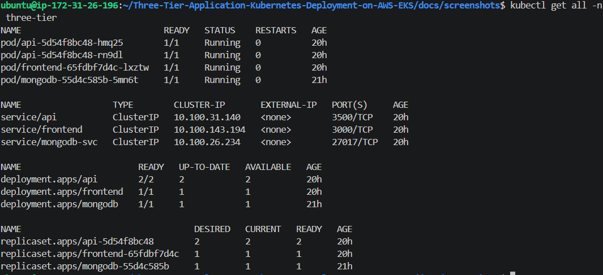
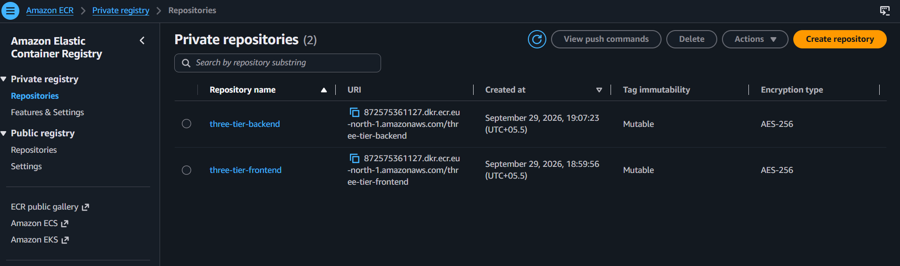
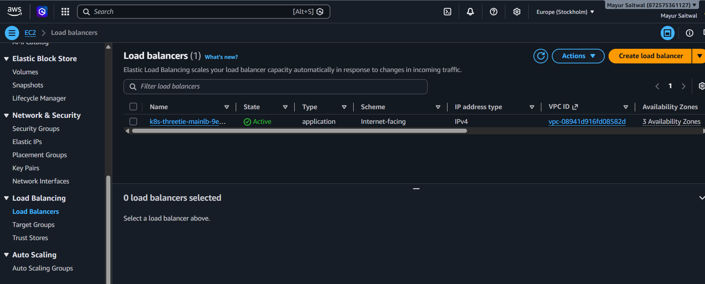
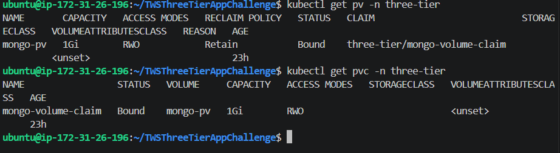
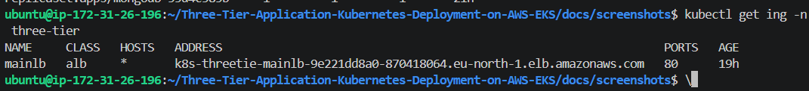
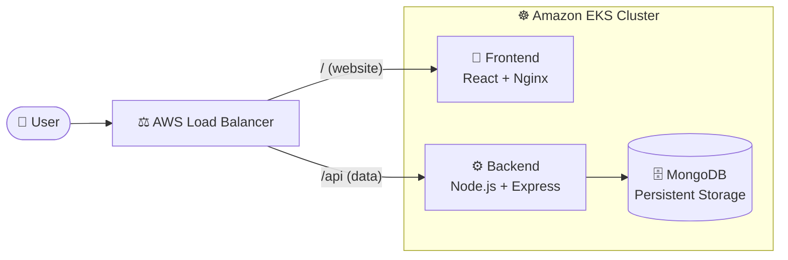
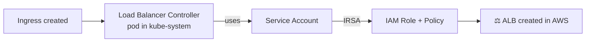

<div align="center">

# ☸️ Three-Tier Application on AWS EKS

### React · Node.js · MongoDB — containerized, pushed to ECR, and exposed through an AWS Load Balancer

<br>


<br>


</div>

---

## 📸 Project Screenshots


### ☸️ Under the Hood

<table>
  <tr>
    <td align="center" width="50%">
      <br>
      <b>EKS Cluster and Node Group</b>
    </td>
    <td align="center" width="50%">
      <br>
      <b>Pods, Services, PV and PVC</b>
    </td>
  </tr>
  <tr>
    <td align="center" width="50%">
      <br>
      <b>Amazon ECR Repositories</b>
    </td>
    <td align="center" width="50%">
      <br>
      <b>AWS Application Load Balancer</b>
    </td>
  </tr>
  <tr>
    <td align="center" width="50%">
      <br>
      <b>Persistent Volume Claim and Persistent Volume</b>
    </td>
    <td align="center" width="50%">
      <br>
      <b>Ingress with ALB Address</b>
    </td>
  </tr>
</table>

---

## 📖 About The Project

This project demonstrates how to deploy a **three-tier web application** on **Amazon EKS** the way it is done in real production environments.

The frontend, backend and database are each packaged as their own **Docker image**, stored in **Amazon ECR**, and deployed to a Kubernetes cluster running on **t3.small** worker nodes. External access is provided by the **AWS Load Balancer Controller**, installed with **Helm** and secured using an **IAM Role for Service Account (IRSA)**.

### ✨ Highlights

| | Feature |
|---|---|
| 🐳 | Separate Docker images for frontend, backend and database |
| 📦 | Images stored in a private **Amazon ECR** registry |
| ☸️ | Deployments and Services for every tier on **Amazon EKS** |
| 🔐 | MongoDB credentials managed with Kubernetes **Secrets** |
| 💾 | Persistent storage for MongoDB using **PV and PVC** |
| ⛵ | **Helm**-based install of the AWS Load Balancer Controller |
| 🪪 | Least-privilege AWS access using an **IAM service account (IRSA)** |
| 🌐 | Public access through an **Ingress** backed by an AWS ALB |

---

## 🏗️ Architecture



### 🔎 How It Works

1. **User** opens the app in the browser and reaches the **AWS Load Balancer**.
2. The Load Balancer sends **`/`** requests to the **Frontend** (React) and **`/api`** requests to the **Backend** (Node.js).
3. The **Backend** reads and writes data in **MongoDB**, which keeps its data on a **Persistent Volume** so nothing is lost on restart.

> 📦 Docker images for all three tiers are stored in **Amazon ECR** and pulled by EKS. 🔐 Database credentials are kept in **Kubernetes Secrets**.

<details>
<summary><b>📋 Tier breakdown (click to expand)</b></summary>

<br>

| Tier | Technology | Kubernetes Resources |
|------|------------|----------------------|
| 🎨 Presentation | React.js served by Nginx | Deployment, Service |
| ⚙️ Application | Node.js + Express | Deployment, Service |
| 🗄️ Database | MongoDB | Deployment, Service, Secret, PV, PVC |
| 🌐 Edge | AWS ALB | Ingress, AWS Load Balancer Controller |

</details>

---

## 🧰 Tech Stack

| Layer | Tools |
|-------|-------|
| **Frontend** | React.js, Nginx |
| **Backend** | Node.js, Express |
| **Database** | MongoDB |
| **Containers** | Docker |
| **Registry** | Amazon ECR |
| **Orchestration** | Amazon EKS (`t3.small` worker nodes) |
| **Packaging** | Helm 3 |
| **Security** | IAM OIDC provider, IRSA, Kubernetes Secrets |
| **Networking** | Ingress, AWS Application Load Balancer |

---

## 📂 Project Structure

```bash
.
├── 📁 Application-Code/
│   ├── ⚙️ backend/
│   │   ├── 📁 models/
│   │   │   └── bank.js
│   │   ├── 📁 routes/
│   │   │   └── bank.js
│   │   ├── .dockerignore
│   │   ├── Dockerfile
│   │   ├── db.js
│   │   ├── index.js
│   │   ├── package-lock.json
│   │   └── package.json
│   │
│   └── 🎨 frontend/
│       ├── 📁 public/
│       │   ├── favicon.ico
│       │   ├── index.html
│       │   ├── logo192.png
│       │   ├── logo512.png
│       │   ├── manifest.json
│       │   └── robots.txt
│       ├── 📁 src/
│       │   ├── 📁 services/
│       │   ├── App.css
│       │   ├── App.js
│       │   ├── index.js
│       │   └── index.css
│       ├── .dockerignore
│       ├── Dockerfile
│       ├── package-lock.json
│       └── package.json
│
├── ☸️ Kubernetes-Manifests-file/
│   ├── 📁 Backend/
│   │   ├── deployment.yaml
│   │   └── service.yaml
│   │
│   ├── 📁 Database/
│   │   ├── deployment.yaml
│   │   ├── pv.yaml
│   │   ├── pvc.yaml
│   │   ├── secret.yaml
│   │   ├── service.yaml
│   │   └── three-tier-backup.yaml
│   │
│   ├── 📁 frontend/
│   │   ├── deployment.yaml
│   │   ├── hpa.yaml
│   │   └── service.yaml
│   │
│   ├── ingress.yaml
│   └── middleware
│
├── 🖼️ assets/
│   └── Three-Tier.gif
│
├── 📸 docs/
│   └── 📁 screenshots/
│       ├── alb.png
│       ├── ecr.png
│       ├── eks.png
│       ├── ingress.png
│       └── kubectl-resources.png
│
└── 📄 README.md
```

> 💡 Adjust file names to match your repository.

---

## ✅ Prerequisites

| Tool | Purpose |
|------|---------|
| 🔑 **AWS CLI** | Authenticate and talk to AWS |
| 🚀 **eksctl** | Create and manage the EKS cluster |
| ☸️ **kubectl** | Interact with the cluster |
| ⛵ **Helm 3** | Install the Load Balancer Controller |
| 🐳 **Docker** | Build container images |

An AWS account with permissions for **EKS, ECR, EC2 and IAM** is also required.

Set these variables once and reuse them in every command below:

```bash
export AWS_REGION=<your-region>            # e.g. ap-south-1
export AWS_ACCOUNT_ID=<your-account-id>
export CLUSTER_NAME=three-tier-cluster
export ECR_URI=$AWS_ACCOUNT_ID.dkr.ecr.$AWS_REGION.amazonaws.com
```

---

## 🚀 Getting Started

### 🔹 Step 1 · Create the EKS Cluster

```bash
eksctl create cluster \
  --name $CLUSTER_NAME \
  --region $AWS_REGION \
  --nodegroup-name workers \
  --node-type t3.small \
  --nodes 2 \
  --nodes-min 2 \
  --nodes-max 3 \
  --managed

# Point kubectl at the new cluster
aws eks update-kubeconfig --name $CLUSTER_NAME --region $AWS_REGION

kubectl get nodes
```

<!-- 📸 Add screenshot: docs/screenshots/eks.png -->

---

### 🔹 Step 2 · Docker Images (Frontend, Backend, Database)

Each tier has its own image so it can be built, versioned and deployed independently.

| Image | Base | Port | Purpose |
|-------|------|------|---------|
| `three-tier/frontend` | node (build) + nginx | 80 | Serves the compiled React app |
| `three-tier/backend` | node:18-alpine | 3000 | REST API, talks to MongoDB |
| `three-tier/database` | mongo | 27017 | MongoDB database |

<details>
<summary><b>🎨 Frontend Dockerfile (multi-stage)</b></summary>

```dockerfile
# Stage 1: build the React app
FROM node:18-alpine AS build
WORKDIR /app
COPY package*.json ./
RUN npm ci
COPY . .
RUN npm run build

# Stage 2: serve with Nginx
FROM nginx:alpine
COPY --from=build /app/build /usr/share/nginx/html
EXPOSE 80
CMD ["nginx", "-g", "daemon off;"]
```

</details>

<details>
<summary><b>⚙️ Backend Dockerfile</b></summary>

```dockerfile
FROM node:18-alpine
WORKDIR /app
COPY package*.json ./
RUN npm ci --omit=dev
COPY . .
EXPOSE 3000
CMD ["node", "server.js"]
```

</details>

<details>
<summary><b>🗄️ Database Dockerfile</b></summary>

```dockerfile
FROM mongo:6
# Optional: seed data or init scripts run on first start
# COPY init.js /docker-entrypoint-initdb.d/
EXPOSE 27017
```

</details>

> 🔒 Credentials are **never** baked into an image. MongoDB receives them at runtime from a Kubernetes Secret.

---

### 🔹 Step 3 · Push Images to Amazon ECR

**Create the repositories**

```bash
aws ecr create-repository --repository-name three-tier/frontend --region $AWS_REGION
aws ecr create-repository --repository-name three-tier/backend  --region $AWS_REGION
aws ecr create-repository --repository-name three-tier/database --region $AWS_REGION
```

**Authenticate Docker to ECR**

```bash
aws ecr get-login-password --region $AWS_REGION | \
  docker login --username AWS --password-stdin $ECR_URI
```

**Build, tag and push**

```bash
# 🎨 Frontend
docker build -t three-tier/frontend:v1 ./frontend
docker tag  three-tier/frontend:v1 $ECR_URI/three-tier/frontend:v1
docker push $ECR_URI/three-tier/frontend:v1

# ⚙️ Backend
docker build -t three-tier/backend:v1 ./backend
docker tag  three-tier/backend:v1 $ECR_URI/three-tier/backend:v1
docker push $ECR_URI/three-tier/backend:v1

# 🗄️ Database
docker build -t three-tier/database:v1 ./database
docker tag  three-tier/database:v1 $ECR_URI/three-tier/database:v1
docker push $ECR_URI/three-tier/database:v1
```

Reference the pushed images in your Deployment manifests:

```yaml
image: <account-id>.dkr.ecr.<region>.amazonaws.com/three-tier/backend:v1
```

> ℹ️ EKS worker nodes pull from ECR automatically through the node IAM role (`AmazonEC2ContainerRegistryReadOnly` is attached by `eksctl`).

<!-- 📸 Add screenshot: docs/screenshots/ecr.png -->

---

### 🔹 Step 4 · Deploy the Application Manifests

**1️⃣ Namespace**

```bash
kubectl apply -f k8s/namespace.yaml
```

**2️⃣ MongoDB: Secret, PV, PVC, Deployment, Service**

> ⚠️ **Never commit real credentials.** Create the secret with kubectl instead:

```bash
kubectl create secret generic mongo-secret \
  --from-literal=MONGO_INITDB_ROOT_USERNAME=<username> \
  --from-literal=MONGO_INITDB_ROOT_PASSWORD=<password> \
  -n <namespace>
```

```bash
kubectl apply -f k8s/mongo-pv.yaml
kubectl apply -f k8s/mongo-pvc.yaml
kubectl apply -f k8s/mongo-deployment.yaml
kubectl apply -f k8s/mongo-service.yaml
```

**3️⃣ Backend**

```bash
kubectl apply -f k8s/backend-deployment.yaml
kubectl apply -f k8s/backend-service.yaml
```

The backend reaches MongoDB through the in-cluster service DNS name, with credentials injected from the Secret.

**4️⃣ Frontend**

```bash
kubectl apply -f k8s/frontend-deployment.yaml
kubectl apply -f k8s/frontend-service.yaml
```

<!-- 📸 Add screenshot: docs/screenshots/kubectl-resources.png -->

---

### 🔹 Step 5 · Install the AWS Load Balancer Controller (Helm + IAM Service Account)

The controller watches Ingress resources and creates an AWS Application Load Balancer. It needs AWS permissions, which are granted to its Kubernetes service account through **IRSA**.



**5.1 · Associate an IAM OIDC provider**

```bash
eksctl utils associate-iam-oidc-provider \
  --cluster $CLUSTER_NAME \
  --region $AWS_REGION \
  --approve
```

**5.2 · Create the IAM policy**

Download the official `iam_policy.json` from the
[aws-load-balancer-controller releases](https://github.com/kubernetes-sigs/aws-load-balancer-controller/releases), then:

```bash
aws iam create-policy \
  --policy-name AWSLoadBalancerControllerIAMPolicy \
  --policy-document file://iam_policy.json
```

**5.3 · Create the IAM service account**

```bash
eksctl create iamserviceaccount \
  --cluster $CLUSTER_NAME \
  --region $AWS_REGION \
  --namespace kube-system \
  --name aws-load-balancer-controller \
  --attach-policy-arn arn:aws:iam::$AWS_ACCOUNT_ID:policy/AWSLoadBalancerControllerIAMPolicy \
  --override-existing-serviceaccounts \
  --approve
```

**5.4 · Install the controller with Helm**

```bash
helm repo add eks https://aws.github.io/eks-charts
helm repo update

helm install aws-load-balancer-controller eks/aws-load-balancer-controller \
  -n kube-system \
  --set clusterName=$CLUSTER_NAME \
  --set serviceAccount.create=false \
  --set serviceAccount.name=aws-load-balancer-controller \
  --set region=$AWS_REGION \
  --set vpcId=<your-vpc-id>
```

```bash
kubectl get deployment -n kube-system aws-load-balancer-controller
```

<!-- 📸 Add screenshot: docs/screenshots/helm-controller.png -->

---

### 🔹 Step 6 · Ingress and External Access

Apply the Ingress so the controller provisions an ALB and routes traffic to your services.

<details>
<summary><b>📄 Example <code>k8s/ingress.yaml</code></b></summary>

```yaml
apiVersion: networking.k8s.io/v1
kind: Ingress
metadata:
  name: three-tier-ingress
  namespace: <namespace>
  annotations:
    alb.ingress.kubernetes.io/scheme: internet-facing
    alb.ingress.kubernetes.io/target-type: ip
spec:
  ingressClassName: alb
  rules:
    - http:
        paths:
          - path: /api
            pathType: Prefix
            backend:
              service:
                name: backend
                port:
                  number: 3000
          - path: /
            pathType: Prefix
            backend:
              service:
                name: frontend
                port:
                  number: 80
```

</details>

```bash
kubectl apply -f k8s/ingress.yaml
kubectl get ingress -n <namespace>
```

⏳ Wait a few minutes until the `ADDRESS` column shows the ALB DNS name, then open:

```
http://<alb-dns-name>
```

---

## 🔍 Verification

```bash
kubectl get nodes
kubectl get pods -n <namespace>
kubectl get svc  -n <namespace>
kubectl get pv,pvc -n <namespace>
kubectl get ingress -n <namespace>
kubectl logs deploy/backend -n <namespace>
```

| Check | Expected result |
|-------|-----------------|
| Pods | All `Running` |
| PVC | `Bound` |
| Ingress | ALB address visible |
| Browser | App loads through the ALB URL |

---

## 🧠 Challenges & Learnings

Replace these with your own experience. These are common issues on this setup:

<details>
<summary><b>🔴 Pods stuck in <code>Pending</code> on t3.small nodes</b></summary>

<br>

**Cause:** t3.small has a low limit on pods per node (network interface and IP limits) and limited memory.
**Fix:** Added resource requests and limits, and scaled the node group.

</details>

<details>
<summary><b>🔴 <code>ImagePullBackOff</code> from ECR</b></summary>

<br>

**Cause:** Wrong image URI, region mismatch, or a missing tag.
**Fix:** Verified the full ECR URI and tag in the manifests.

</details>

<details>
<summary><b>🔴 Load Balancer Controller not creating the ALB</b></summary>

<br>

**Cause:** Missing IAM policy or incorrect service account setup.
**Fix:** Recreated the IRSA service account and checked the controller logs.

</details>

<details>
<summary><b>🔴 PVC stuck in <code>Pending</code></b></summary>

<br>

**Cause:** StorageClass or PV mismatch (capacity or access mode).
**Fix:** Aligned the PV and PVC specs.

</details>

<details>
<summary><b>🔴 Backend unable to reach MongoDB</b></summary>

<br>

**Cause:** Wrong service name or credentials.
**Fix:** Used the in-cluster service DNS name and the correct Secret keys.

</details>

### 🎓 Key Takeaways

- ✅ How to package each tier as an independent Docker image
- ✅ How ECR integrates with EKS worker nodes
- ✅ How Secrets, PV and PVC handle configuration and persistence
- ✅ How IRSA gives pods AWS permissions without static keys
- ✅ How Helm, Ingress and the ALB expose a cluster to the internet

---

## 🧹 Cleanup

Delete the Ingress first so the ALB is removed, then the cluster, to avoid ongoing AWS charges.

```bash
kubectl delete -f k8s/ingress.yaml
kubectl delete -f k8s/
helm uninstall aws-load-balancer-controller -n kube-system
eksctl delete cluster --name $CLUSTER_NAME --region $AWS_REGION

# Optional: remove ECR repositories
aws ecr delete-repository --repository-name three-tier/frontend --force --region $AWS_REGION
aws ecr delete-repository --repository-name three-tier/backend  --force --region $AWS_REGION
aws ecr delete-repository --repository-name three-tier/database --force --region $AWS_REGION
```

---

## 🔮 Future Improvements

- [ ] CI/CD pipeline with GitHub Actions (build, push to ECR, deploy to EKS)
- [ ] MongoDB as a StatefulSet with an EBS-backed StorageClass
- [ ] Liveness and readiness probes
- [ ] Horizontal Pod Autoscaler
- [ ] HTTPS with AWS Certificate Manager and Route 53
- [ ] Monitoring with Prometheus and Grafana
- [ ] Package all manifests as a Helm chart

---

<div align="center">

## 👨‍💻 Author

**Mayur Gopal Saitwal**

[](https://github.com/MayurSaitwal)
[](https://www.linkedin.com/in/mayursaitwal/)
[](mailto:mayursaitwal81@gmail.com)

<br>

⭐ **If you found this project useful, please give it a star!** ⭐

</div>
